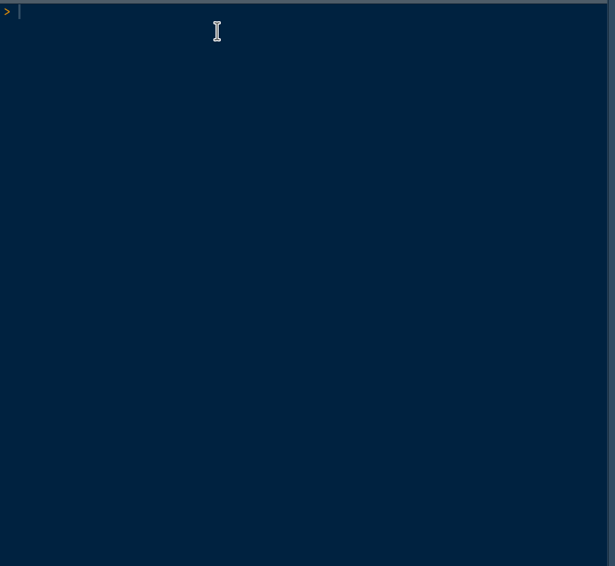

# fasttyper

<!-- badges: start -->
<!-- badges: end -->

Do you want to train yourself to type code so that you can code faster? Do you want to simulate some code so that you can test some shortcuts? Here comes `{fasttyper}`! The goal of this package is to print some code in the console that you have to rewrite without making any mistakes.

For now, it only has three levels (that you can call with the `level_*()` functions), and a few base and tidyverse functions. Feel free to mention in an issue the functions/levels you would like to add, or to add them yourself with a PR. You can install this package with:

```r
# install.packages("devtools")
devtools::install_github("etiennebacher/fasttyper")
```

## Demo



## Code of Conduct
  
  Please note that the fasttyper project is released with a [Contributor Code of Conduct](https://contributor-covenant.org/version/2/0/CODE_OF_CONDUCT.html). By contributing to this project, you agree to abide by its terms.

